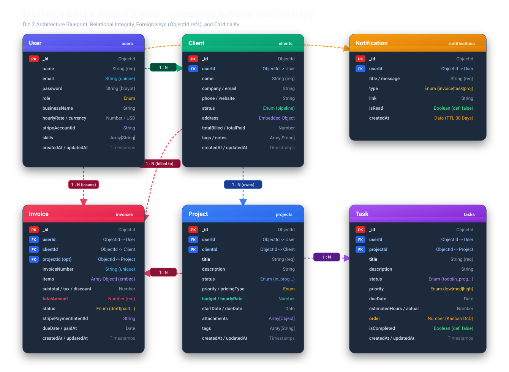
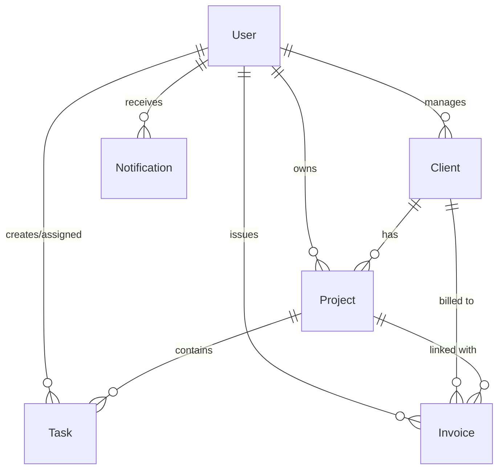

<div align="center">

# 💼 Freelance CRM & Project Tracker

**A modern, production-ready MERN stack CRM and project management platform built specifically for freelancers and digital agencies.**

[](https://github.com/ahsanadeem840-ai/freelancer-crm-tracker)
[](https://react.dev/)
[](LICENSE)

<p align="center">
  <a href="#-key-features">Key Features</a> •
  <a href="#-tech-stack">Tech Stack</a> •
  <a href="#-database-architecture">Database Architecture</a> •
  <a href="#-22-day-development-roadmap">22-Day Roadmap</a> •
  <a href="#-project-structure">Project Structure</a> •
  <a href="#-getting-started">Getting Started</a>
</p>

---

</div>

## 📖 Overview

Most enterprise CRM software is bloated, overly complex, and expensive for solo freelancers and small boutique agencies. 

**Freelance CRM & Project Tracker** is designed to provide an agile, unified workspace where you can:
- Manage client relationships and pipelines
- Organize projects and track deliverables with interactive Kanban boards
- Receive instant, real-time collaboration updates via **Socket.io**
- Issue invoices and get paid directly through **Stripe**

---

## ✨ Key Features

| Category | Features Included |
| :--- | :--- |
| **👥 Client Management (CRM)** | Lead & prospect pipeline stages, contact directory, address book, client revenue tracking, and custom tags. |
| **📁 Project Tracking** | Fixed vs. hourly billing projects, milestone deadlines, budgets, progress tracking, and file attachments. |
| **📋 Kanban Task Board** | Drag-and-drop task workflows (`Todo`, `In Progress`, `Review`, `Done`), priority tags, and hour estimates. |
| **⚡ Real-Time Engine** | Live in-app notifications powered by **Socket.io** (task assignments, invoice payments, client updates). |
| **💳 Invoicing & Payments** | Automated PDF/web invoices, tax/discount computations, and direct checkout links via **Stripe API**. |
| **🔐 Enterprise Security** | JWT-based auth, secure HTTP-only cookies, password hashing with `bcryptjs`, and strict role-based access control. |

---

## 🛠️ Tech Stack

<div align="center">

| Layer | Technology | Purpose |
| :--- | :--- | :--- |
| **Frontend** | React 18, React Router v6 | Single Page Application (SPA) architecture |
| **Styling** | Tailwind CSS | Modern, responsive, utility-first UI design |
| **State & HTTP** | Context API / Hooks, Axios | Centralized state management & API client |
| **Backend** | Node.js, Express.js | RESTful API service & middleware pipeline |
| **Database** | MongoDB, Mongoose ODM | Document-based data persistence with schema enforcement |
| **Real-Time** | Socket.io | Bi-directional, low-latency event communication |
| **Payments** | Stripe API & Webhooks | Secure online checkout & instant payment reconciliation |
| **Authentication** | JWT, bcryptjs | Stateless token auth & cryptographic password hashing |

</div>

---

## 🗄️ Database Architecture

The system utilizes 6 core MongoDB collections designed with strict Mongoose validation schemas, indexes, and referential integrity:





> 📄 **Detailed Documentation & Diagrams:**
> - [Database Planning & Schema Specs (Din 1)](docs/DATABASE_SCHEMA.md)
> - [Schema Relationships & Integrity Blueprint (Din 2)](docs/SCHEMA_RELATIONSHIPS.md)
> - [Backend Setup & Server Initialization (Din 3)](docs/BACKEND_SETUP.md)
> - [Folder Structure & MongoDB Connection (Din 4)](docs/FOLDER_STRUCTURE_AND_DB.md)
> - [User Model & Signup API (Din 5)](docs/USER_MODEL_AND_SIGNUP_API.md)
> - [Login API & JWT Verification (Din 6)](docs/LOGIN_API_AND_JWT.md)
> - [Role-Based Access Control & Middleware (Din 7)](docs/ROLE_BASED_ACCESS_CONTROL.md)
> - [Client CRUD API & CRM Pipeline (Din 8)](docs/CLIENT_CRUD_API.md)
> - [Project CRUD API & Client Linking (Din 9)](docs/PROJECT_CRUD_API.md)
> - [Task CRUD API & Project Linking (Din 10)](docs/TASK_CRUD_API.md)
> - [Invoice API & Full Backend Test (Din 11)](docs/INVOICE_API_AND_FULL_BACKEND_TEST.md)
> - [Interactive Excalidraw Diagram File](docs/schema-diagram.excalidraw) (Open on [excalidraw.com](https://excalidraw.com))
> - [High-Resolution SVG Vector Diagram](docs/schema-diagram.svg)

---

## 📅 22-Day Development Roadmap

This project is built following an intensive 22-day production roadmap (1 focused task per day):

### Phase 1: Planning & Architecture
- [x] **Din 1: Database Planning**
  - [x] Identify MongoDB collections: `User`, `Client`, `Project`, `Task`, `Invoice`, `Notification`
  - [x] Finalize data types, constraints, and compound indexes ([docs/DATABASE_SCHEMA.md](docs/DATABASE_SCHEMA.md))
- [x] **Din 2: Schema Relationships & Visual Diagramming**
  - [x] Collections k beech relationship map karein (`Project -> Tasks`, `Client -> Projects`, etc.) ([docs/SCHEMA_RELATIONSHIPS.md](docs/SCHEMA_RELATIONSHIPS.md))
  - [x] Excalidraw / visual schema diagram banayein ([docs/schema-diagram.excalidraw](docs/schema-diagram.excalidraw), [docs/schema-diagram.svg](docs/schema-diagram.svg))
- [x] **Din 3: Backend Setup & Environment Configuration**
  - [x] Node.js & Express server boilerplate, environment variables, security headers (`helmet`, `cors`) ([docs/BACKEND_SETUP.md](docs/BACKEND_SETUP.md))
- [x] **Din 4: Database Connection & Mongoose Schemas**
  - [x] Folder structure banayein: `models`, `routes`, `controllers`, `middleware`
  - [x] MongoDB Atlas connection with Mongoose ODM & connection lifecycle events ([docs/FOLDER_STRUCTURE_AND_DB.md](docs/FOLDER_STRUCTURE_AND_DB.md))
  - [x] All 6 Mongoose Schemas compiled (`User`, `Client`, `Project`, `Task`, `Invoice`, `Notification`)

### Phase 2: Authentication & Security
- [x] **Din 5: User Model & Signup API**
  - [x] User Mongoose schema with data validation, roles, and timestamps ([docs/USER_MODEL_AND_SIGNUP_API.md](docs/USER_MODEL_AND_SIGNUP_API.md))
  - [x] Bcrypt password hashing pre-save hook & `matchPassword` instance method
  - [x] Signup / Registration REST API (`POST /api/auth/register`, `/signup`) with JWT token issuance
- [x] **Din 6: Login API + JWT**
  - [x] Login API banayein (`POST /api/auth/login`, `POST /api/auth/signin`) ([docs/LOGIN_API_AND_JWT.md](docs/LOGIN_API_AND_JWT.md))
  - [x] JWT token generate karein aur verify middleware likhein (`protect` & `verifyToken`)
  - [x] Role-based access control guard (`authorize`) & user profile endpoint (`GET /api/auth/me`)
  - [x] Automated 14-point verification test suite (`npm run test:day6`)
- [x] **Din 7: Role-Based Access Control (RBAC)**
  - [x] Admin aur Client role field add karein in User schema (`admin`, `client`, `freelancer`, `agency_owner`, `team_member`)
  - [x] Middleware banayein jo route ko role k hisaab se protect kare (`authorize`, `checkRole`, `isAdmin`, `isClient`, `isAdminOrClient`) ([docs/ROLE_BASED_ACCESS_CONTROL.md](docs/ROLE_BASED_ACCESS_CONTROL.md))
  - [x] Role-protected route guards (`/admin-dashboard`, `/client-portal`, `/admin-or-client`, `/clients`)
  - [x] Automated 29-point verification test suite (`npm run test:day7`)

### Phase 3: Client & Project Management
- [x] **Din 8: Client CRM CRUD API**
  - [x] Client model, validation rules, address schema & pipeline statuses (`lead`, `prospect`, `active`, `inactive`)
  - [x] Multi-tenant CRUD endpoints (`POST /api/clients`, `GET /api/clients`, `GET /api/clients/:id`, `PUT/PATCH`, `DELETE`)
  - [x] CRM pipeline analytics & financial totals (`GET /api/clients/stats`) ([docs/CLIENT_CRUD_API.md](docs/CLIENT_CRUD_API.md))
  - [x] Automated 36-point test suite (`npm run test:day8`) & Postman suite ([postman/Freelancer_CRM_Day8_Clients.postman_collection.json](postman/Freelancer_CRM_Day8_Clients.postman_collection.json))
- [x] **Din 9: Project Management API**
  - [x] Project create, update, delete, list APIs with multi-tenancy & pagination (`/api/projects`)
  - [x] Client se Project ka relation link karein (`clientId` validation & multi-tenant check, `GET /api/clients/:id/projects`)
  - [x] Project pipeline statistics & financial metrics (`GET /api/projects/stats`) ([docs/PROJECT_CRUD_API.md](docs/PROJECT_CRUD_API.md))
  - [x] Automated 51-point test suite (`npm run test:day9`) & Postman suite ([postman/Freelancer_CRM_Day9_Projects.postman_collection.json](postman/Freelancer_CRM_Day9_Projects.postman_collection.json))
- [x] **Din 10: Task Management & Kanban API**
  - [x] Task create, update, delete, list APIs with multi-tenancy & pagination (`/api/tasks`)
  - [x] Task ko Project se link karein, status field add karein (`projectId` validation & multi-tenant check, `GET /api/projects/:id/tasks`)
  - [x] Kanban batch drag-and-drop column & order reordering (`PUT /api/tasks/reorder`)
  - [x] Task pipeline statistics & productivity metrics (`GET /api/tasks/stats`) ([docs/TASK_CRUD_API.md](docs/TASK_CRUD_API.md))
  - [x] Automated 55-point test suite (`npm run test:day10`) & Postman suite ([postman/Freelancer_CRM_Day10_Tasks.postman_collection.json](postman/Freelancer_CRM_Day10_Tasks.postman_collection.json))

### Phase 4: Financials & Invoicing
- [x] **Din 11: Invoice Generation & Line Items API + Full Backend Test**
  - [x] Invoice model aur basic generate API banayein (`POST /api/invoices/generate`, `POST /api/invoices`)
  - [x] Line items, tax rate, discount aur total calculation pre-validate hook
  - [x] Client financial balances reconciliation (`totalBilled` & `totalPaid`)
  - [x] Relationship endpoints: `GET /api/clients/:id/invoices` & `GET /api/projects/:id/invoices`
  - [x] Financial analytics & summary (`GET /api/invoices/stats`) ([docs/INVOICE_API_AND_FULL_BACKEND_TEST.md](docs/INVOICE_API_AND_FULL_BACKEND_TEST.md))
  - [x] Sab APIs ko Postman se dobara end-to-end test karein ([postman/Freelancer_CRM_Day11_Invoices_And_E2E.postman_collection.json](postman/Freelancer_CRM_Day11_Invoices_And_E2E.postman_collection.json))
  - [x] Automated 75-point test suite (`npm run test:day11`)
- [ ] **Din 12: Stripe Checkout & Webhooks Integration**

### Phase 5: Real-Time Engine
- [ ] **Din 13: Socket.io Setup & Live Event Handlers**
- [ ] **Din 14: Notification System & Activity Feeds**

### Phase 6: Frontend Development (React + Tailwind CSS)
- [ ] **Din 15: React Boilerplate & Tailwind Theme Setup**
- [ ] **Din 16: Auth UI & Protected Routes**
- [ ] **Din 17: Freelancer Dashboard & Analytics Cards**
- [ ] **Din 18: Client CRM UI & Pipeline View**
- [ ] **Din 19: Project Tracker & Milestone Overview**
- [ ] **Din 20: Interactive Kanban Board (Drag & Drop)**
- [ ] **Din 21: Invoice Builder & Stripe Payment Portal**
- [ ] **Din 22: Real-time Socket.io Notification Bell & Toast Alerts**

### Phase 7: Polish, Testing & Deployment
- [ ] **Din 23: End-to-End Testing & Bug Fixes**
- [ ] **Din 24: Production Build & Cloud Deployment**

---

## 📁 Project Structure

```text
freelancer-crm-tracker/
├── .gitignore                  # Standard ignore list for dependencies & env
├── README.md                   # Project documentation & roadmap tracker
├── package.json                # Root workspace convenience scripts (npm run server)
├── app.js                      # Root server proxy forwarder
├── docs/                       # Architectural & technical documentation
│   ├── DATABASE_SCHEMA.md      # Din 1 MongoDB schema blueprint
│   ├── SCHEMA_RELATIONSHIPS.md # Din 2 Relationships & integrity blueprint
│   ├── BACKEND_SETUP.md        # Din 3 Backend setup & Express architecture
│   ├── FOLDER_STRUCTURE_AND_DB.md # Din 4 Folder structure & DB setup
│   ├── USER_MODEL_AND_SIGNUP_API.md # Din 5 User model & Signup API
│   ├── LOGIN_API_AND_JWT.md    # Din 6 Login API & JWT verification middleware
│   ├── ROLE_BASED_ACCESS_CONTROL.md # Din 7 RBAC & security middleware
│   ├── CLIENT_CRUD_API.md      # Din 8 Client CRUD API & CRM pipeline
│   ├── PROJECT_CRUD_API.md     # Din 9 Project CRUD API & Client linking
│   ├── TASK_CRUD_API.md        # Din 10 Task CRUD API, Project linking & Kanban
│   ├── schema-diagram.svg      # Din 2 Vector architecture diagram
│   └── schema-diagram.excalidraw # Din 2 Interactive Excalidraw file
├── scripts/                    # Automation & architecture generator scripts
├── postman/                    # Postman collection test suites (Day 8, 9, 10)
├── client/                     # (Upcoming) React + Tailwind CSS Frontend
└── server/                     # Node.js + Express Backend
    ├── package.json            # Backend dependencies (express, mongoose, etc.)
    ├── .env                    # Local environment secrets (Git-ignored)
    ├── .env.example            # Environment variables template
    ├── app.js                  # Main Express application & HTTP server
    ├── config/                 # DB connection configuration (db.js)
    ├── models/                 # Mongoose schemas (User, Client, Project, Task, Invoice, Notification)
    ├── controllers/            # Controller business logic
    ├── routes/                 # Express API routes (/api/auth, /api/clients, /api/projects, /api/tasks)
    ├── middleware/             # Error handlers and auth guards
    └── tests/                  # Verification test suites (verify_day5 to verify_day10)
```

---

## 🚀 Getting Started

### Prerequisites
- **Node.js** (v18+ recommended)
- **MongoDB** (Local instance or MongoDB Atlas URI)
- **Git**

### Installation & Running Backend (Din 3)
```bash
# 1. Clone the repository
git clone https://github.com/ahsanadeem840-ai/freelancer-crm-tracker.git

# 2. Navigate into project directory
cd freelancer-crm-tracker

# 3. Option A: Run directly from root
npm run server

# 3. Option B: Run from server directory
cd server
npm install
npm run dev
```

### Running Automated Tests
```bash
# Run latest tests directly from workspace root
npm test

# Run specific roadmap day test suites
npm run test:day5    # User Model & Signup API (22 tests)
npm run test:day6    # Login API & JWT Middleware (23 tests)
npm run test:day7    # Role-Based Access Control - RBAC (29 tests)
npm run test:day8    # Client CRM CRUD API & Pipeline (36 tests)
npm run test:day9    # Project CRUD API & Client Linking (51 tests)
npm run test:day10   # Task CRUD API & Project Linking (55 tests)
npm run test:day11   # Invoice API & Full Backend Test (75 tests)
npm run test:all     # Full end-to-end regression test suite (291 tests)
```

---

## 🔒 Security Best Practices

- **Strict Validation:** Input sanitation with schema level constraints.
- **Environment Isolation:** Zero credentials committed; all secrets kept in `.env`.
- **Stateless Authentication:** Secure JWT with expiration and token renewal.
- **Encrypted Data:** Salted bcrypt hashing for all stored credentials.

---

## 👤 Author

**Muhammad Ahsan**
- GitHub: [@ahsanadeem840-ai](https://github.com/ahsanadeem840-ai)

---

## 📄 License

This project is licensed under the MIT License - see the [LICENSE](LICENSE) file for details.
