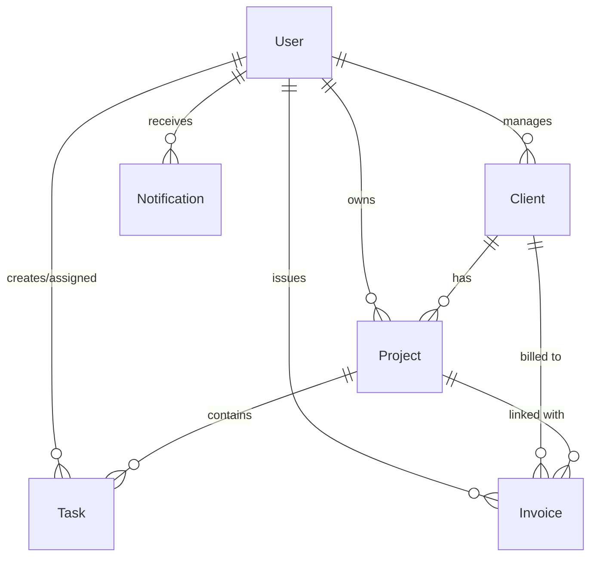

<div align="center">

# 💼 Freelance CRM & Project Tracker

**A modern, production-ready MERN stack CRM and project management platform built specifically for freelancers and digital agencies.**

[](https://github.com/ahsanadeem840-ai/freelancer-crm-tracker)
[](https://react.dev/)
[](LICENSE)

<p align="center">
  <a href="#-key-features">Key Features</a> •
  <a href="#-tech-stack">Tech Stack</a> •
  <a href="#-database-architecture">Database Architecture</a> •
  <a href="#-22-day-development-roadmap">22-Day Roadmap</a> •
  <a href="#-project-structure">Project Structure</a> •
  <a href="#-getting-started">Getting Started</a>
</p>

---

</div>

## 📖 Overview

Most enterprise CRM software is bloated, overly complex, and expensive for solo freelancers and small boutique agencies. 

**Freelance CRM & Project Tracker** is designed to provide an agile, unified workspace where you can:
- Manage client relationships and pipelines
- Organize projects and track deliverables with interactive Kanban boards
- Receive instant, real-time collaboration updates via **Socket.io**
- Issue invoices and get paid directly through **Stripe**

---

## ✨ Key Features

| Category | Features Included |
| :--- | :--- |
| **👥 Client Management (CRM)** | Lead & prospect pipeline stages, contact directory, address book, client revenue tracking, and custom tags. |
| **📁 Project Tracking** | Fixed vs. hourly billing projects, milestone deadlines, budgets, progress tracking, and file attachments. |
| **📋 Kanban Task Board** | Drag-and-drop task workflows (`Todo`, `In Progress`, `Review`, `Done`), priority tags, and hour estimates. |
| **⚡ Real-Time Engine** | Live in-app notifications powered by **Socket.io** (task assignments, invoice payments, client updates). |
| **💳 Invoicing & Payments** | Automated PDF/web invoices, tax/discount computations, and direct checkout links via **Stripe API**. |
| **🔐 Enterprise Security** | JWT-based auth, secure HTTP-only cookies, password hashing with `bcryptjs`, and strict role-based access control. |

---

## 🛠️ Tech Stack

<div align="center">

| Layer | Technology | Purpose |
| :--- | :--- | :--- |
| **Frontend** | React 18, React Router v6 | Single Page Application (SPA) architecture |
| **Styling** | Tailwind CSS | Modern, responsive, utility-first UI design |
| **State & HTTP** | Context API / Hooks, Axios | Centralized state management & API client |
| **Backend** | Node.js, Express.js | RESTful API service & middleware pipeline |
| **Database** | MongoDB, Mongoose ODM | Document-based data persistence with schema enforcement |
| **Real-Time** | Socket.io | Bi-directional, low-latency event communication |
| **Payments** | Stripe API & Webhooks | Secure online checkout & instant payment reconciliation |
| **Authentication** | JWT, bcryptjs | Stateless token auth & cryptographic password hashing |

</div>

---

## 🗄️ Database Architecture

The system utilizes 6 core MongoDB collections designed with strict Mongoose validation schemas, indexes, and referential integrity:




> 📄 **Detailed Documentation & Diagrams:**
> - [Database Planning & Schema Specs (Din 1)](docs/DATABASE_SCHEMA.md)
> - [Schema Relationships & Integrity Blueprint (Din 2)](docs/SCHEMA_RELATIONSHIPS.md)
> - [Interactive Excalidraw Diagram File](docs/schema-diagram.excalidraw) (Open on [excalidraw.com](https://excalidraw.com))
> - [High-Resolution SVG Vector Diagram](docs/schema-diagram.svg)

---

## 📅 22-Day Development Roadmap

This project is built following an intensive 22-day production roadmap (1 focused task per day):

### Phase 1: Planning & Architecture
- [x] **Din 1: Database Planning**
  - [x] Identify MongoDB collections: `User`, `Client`, `Project`, `Task`, `Invoice`, `Notification`
  - [x] Finalize data types, constraints, and compound indexes ([docs/DATABASE_SCHEMA.md](docs/DATABASE_SCHEMA.md))
- [x] **Din 2: Schema Relationships & Visual Diagramming**
  - [x] Collections k beech relationship map karein (`Project -> Tasks`, `Client -> Projects`, etc.) ([docs/SCHEMA_RELATIONSHIPS.md](docs/SCHEMA_RELATIONSHIPS.md))
  - [x] Excalidraw / visual schema diagram banayein ([docs/schema-diagram.excalidraw](docs/schema-diagram.excalidraw), [docs/schema-diagram.svg](docs/schema-diagram.svg))
- [x] **Din 3: Backend Setup & Environment Configuration**
  - [x] Node.js & Express server boilerplate, environment variables, security headers (`helmet`, `cors`) ([docs/BACKEND_SETUP.md](docs/BACKEND_SETUP.md))
- [x] **Din 4: Database Connection & Mongoose Schemas**
  - [x] Folder structure banayein: `models`, `routes`, `controllers`, `middleware`
  - [x] MongoDB Atlas connection with Mongoose ODM & connection lifecycle events ([docs/FOLDER_STRUCTURE_AND_DB.md](docs/FOLDER_STRUCTURE_AND_DB.md))
  - [x] All 6 Mongoose Schemas compiled (`User`, `Client`, `Project`, `Task`, `Invoice`, `Notification`)

### Phase 2: Authentication & Security
- [ ] **Din 5: Auth API & Security Middleware** (Register, Login, JWT verification, Bcrypt hashing)
- [ ] **Din 6: Role-Based Authorization & Profile Management**

### Phase 3: Client & Project Management
- [ ] **Din 7: Client CRM CRUD API**
- [ ] **Din 8: Project Management API**
- [ ] **Din 9: Task Management & Kanban API**

### Phase 4: Financials & Invoicing
- [ ] **Din 10: Invoice Generation & Line Items API**
- [ ] **Din 11: Stripe Checkout & Webhooks Integration**

### Phase 5: Real-Time Engine
- [ ] **Din 12: Socket.io Setup & Live Event Handlers**
- [ ] **Din 13: Notification System & Activity Feeds**

### Phase 6: Frontend Development (React + Tailwind CSS)
- [ ] **Din 14: React Boilerplate & Tailwind Theme Setup**
- [ ] **Din 15: Auth UI & Protected Routes**
- [ ] **Din 16: Freelancer Dashboard & Analytics Cards**
- [ ] **Din 17: Client CRM UI & Pipeline View**
- [ ] **Din 18: Project Tracker & Milestone Overview**
- [ ] **Din 19: Interactive Kanban Board (Drag & Drop)**
- [ ] **Din 20: Invoice Builder & Stripe Payment Portal**
- [ ] **Din 21: Real-time Socket.io Notification Bell & Toast Alerts**

### Phase 7: Polish, Testing & Deployment
- [ ] **Din 22: End-to-End Testing & Bug Fixes**
- [ ] **Din 23: Production Build & Cloud Deployment**

---

## 📁 Project Structure

```text
freelancer-crm-tracker/
├── .gitignore                  # Standard ignore list for dependencies & env
├── README.md                   # Project documentation & roadmap tracker
├── package.json                # Root workspace convenience scripts (npm run server)
├── app.js                      # Root server proxy forwarder
├── docs/                       # Architectural & technical documentation
│   ├── DATABASE_SCHEMA.md      # Din 1 MongoDB schema blueprint
│   ├── SCHEMA_RELATIONSHIPS.md # Din 2 Relationships & integrity blueprint
│   ├── BACKEND_SETUP.md        # Din 3 Backend setup & Express architecture
│   ├── FOLDER_STRUCTURE_AND_DB.md # Din 4 Folder structure & DB setup
│   ├── schema-diagram.svg      # Din 2 Vector architecture diagram
│   └── schema-diagram.excalidraw # Din 2 Interactive Excalidraw file
├── scripts/                    # Automation & architecture generator scripts
├── client/                     # (Upcoming) React + Tailwind CSS Frontend
└── server/                     # Node.js + Express Backend
    ├── package.json            # Backend dependencies (express, mongoose, etc.)
    ├── .env                    # Local environment secrets (Git-ignored)
    ├── .env.example            # Environment variables template
    ├── app.js                  # Main Express application & HTTP server
    ├── config/                 # DB connection configuration (db.js)
    ├── models/                 # Mongoose schemas (User, Client, Project, Task, Invoice, Notification)
    ├── controllers/            # Controller business logic
    ├── routes/                 # Express API routes (/api/auth, /api/clients, etc.)
    └── middleware/             # Error handlers and auth guards
```

---

## 🚀 Getting Started

### Prerequisites
- **Node.js** (v18+ recommended)
- **MongoDB** (Local instance or MongoDB Atlas URI)
- **Git**

### Installation & Running Backend (Din 3)
```bash
# 1. Clone the repository
git clone https://github.com/ahsanadeem840-ai/freelancer-crm-tracker.git

# 2. Navigate into project directory
cd freelancer-crm-tracker

# 3. Option A: Run directly from root
npm run server

# 3. Option B: Run from server directory
cd server
npm install
npm run dev
```

---

## 🔒 Security Best Practices

- **Strict Validation:** Input sanitation with schema level constraints.
- **Environment Isolation:** Zero credentials committed; all secrets kept in `.env`.
- **Stateless Authentication:** Secure JWT with expiration and token renewal.
- **Encrypted Data:** Salted bcrypt hashing for all stored credentials.

---

## 👤 Author

**Muhammad Ahsan**
- GitHub: [@ahsanadeem840-ai](https://github.com/ahsanadeem840-ai)

---

## 📄 License

This project is licensed under the MIT License - see the [LICENSE](LICENSE) file for details.
