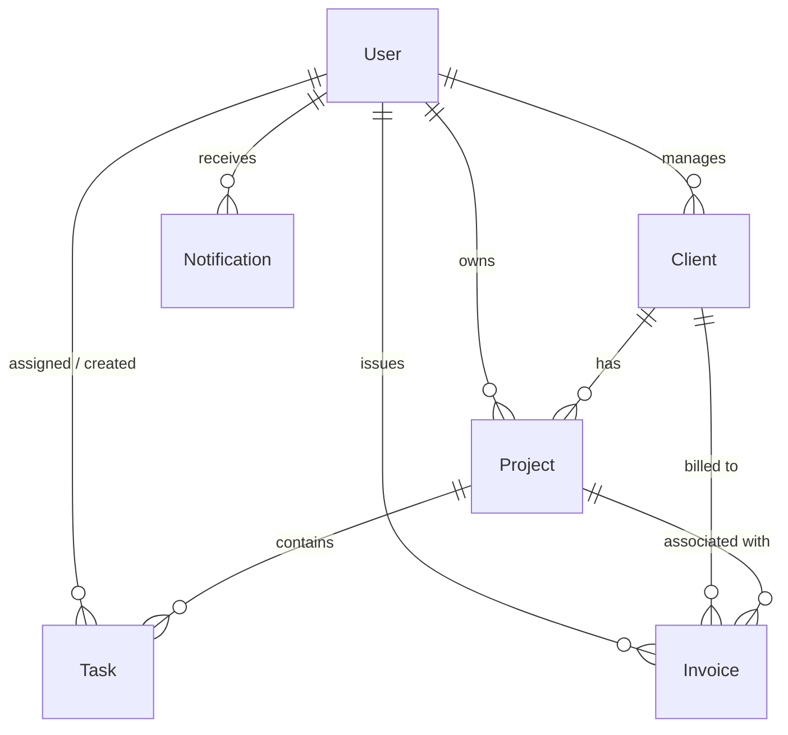

# Database Planning & Schema Architecture

**Project:** Freelance CRM & Project Tracker  
**Roadmap Stage:** Din 1 (Database Planning)  
**Database:** MongoDB (Mongoose ODM)  

---

## 1. Overview & Architecture

Freelance CRM & Project Tracker ka data model freelancers, agencies, unke clients, ongoing projects, tasks, aur billing/invoices ko seamlessly connect karne ke liye design kiya gaya hai.

### Entity Relationship Diagram (ERD)

---

## 2. Collections Specification

### 2.1 User Collection (`users`)
Freelancers, agency owners, ya team members ki authentication, profile details, aur Stripe account info manage karta hai.

- **`_id`** (`ObjectId`): Unique identifier
- **`name`** (`String`): Required, Trimmed, Max: 100
- **`email`** (`String`): Required, Unique, Lowercase, Trimmed, Validated with Email Regex
- **`password`** (`String`): Required, Min length 6 (Hashed with `bcrypt`, `select: false` by default)
- **`role`** (`String`): Enum `['freelancer', 'agency_owner', 'team_member']`, Default: `'freelancer'`
- **`businessName`** (`String`): Optional, Trimmed
- **`avatar`** (`String`): Optional URL to image
- **`phone`** (`String`): Optional contact number
- **`hourlyRate`** (`Number`): Optional, Min: 0
- **`currency`** (`String`): Default: `'USD'` (Options: `'USD'`, `'EUR'`, `'GBP'`, `'PKR'`, `'INR'`, etc.)
- **`stripeAccountId`** (`String`): Optional, Stripe Connect Account ID for payouts
- **`stripeCustomerId`** (`String`): Optional, Stripe Customer ID
- **`skills`** (`[String]`): Array of freelancer skills (e.g. `['React', 'Node.js']`)
- **`isEmailVerified`** (`Boolean`): Default: `false`
- **`resetPasswordToken`** (`String`): Optional hashed token
- **`resetPasswordExpire`** (`Date`): Optional expiration timestamp
- **`createdAt` / `updatedAt`** (`Date`): Timestamps enabled

**Indexes:**
- `{ email: 1 }` (Unique)

---

### 2.2 Client Collection (`clients`)
Har freelancer ke clients ki complete history, contact information, CRM pipeline status, aur billing totals maintain karta hai.

- **`_id`** (`ObjectId`): Unique identifier
- **`userId`** (`ObjectId`, ref: `'User'`): Required, Indexed (Client owner)
- **`name`** (`String`): Required, Trimmed, Max: 100 (Primary contact person)
- **`company`** (`String`): Optional, Trimmed (Company/Brand name)
- **`email`** (`String`): Required, Lowercase, Trimmed
- **`phone`** (`String`): Optional, Trimmed
- **`website`** (`String`): Optional URL
- **`address`** (`Object`):
  - `street` (`String`)
  - `city` (`String`)
  - `state` (`String`)
  - `zip` (`String`)
  - `country` (`String`)
- **`status`** (`String`): Enum `['lead', 'prospect', 'active', 'inactive']`, Default: `'lead'`
- **`currency`** (`String`): Default: `'USD'`
- **`notes`** (`String`): Internal notes about client preferences
- **`tags`** (`[String]`): e.g. `['High-Priority', 'Retainer', 'Web-Dev']`
- **`totalBilled`** (`Number`): Default: `0`, Min: 0
- **`totalPaid`** (`Number`): Default: `0`, Min: 0
- **`createdAt` / `updatedAt`** (`Date`): Timestamps enabled

**Indexes:**
- `{ userId: 1, email: 1 }` (Unique compound index per freelancer)
- `{ userId: 1, status: 1 }` (Pipeline filtering)

---

### 2.3 Project Collection (`projects`)
Clients ke sath chalne wale projects ka record, budget, timeline, aur execution status track karta hai.

- **`_id`** (`ObjectId`): Unique identifier
- **`userId`** (`ObjectId`, ref: `'User'`): Required, Indexed
- **`clientId`** (`ObjectId`, ref: `'Client'`): Required, Indexed
- **`title`** (`String`): Required, Trimmed, Max: 150
- **`description`** (`String`): Optional scope description
- **`status`** (`String`): Enum `['planning', 'in_progress', 'in_review', 'completed', 'cancelled', 'on_hold']`, Default: `'planning'`
- **`priority`** (`String`): Enum `['low', 'medium', 'high', 'urgent']`, Default: `'medium'`
- **`pricingType`** (`String`): Enum `['fixed', 'hourly']`, Default: `'fixed'`
- **`budget`** (`Number`): Required, Min: 0
- **`hourlyRate`** (`Number`): Optional, Min: 0 (if `pricingType === 'hourly'`)
- **`startDate`** (`Date`): Optional
- **`dueDate`** (`Date`): Optional deadline
- **`completedAt`** (`Date`): Optional completion timestamp
- **`attachments`** (`[Object]`):
  - `name` (`String`)
  - `url` (`String`)
  - `uploadedAt` (`Date`)
- **`tags`** (`[String]`): e.g. `['Fullstack', 'Frontend']`
- **`createdAt` / `updatedAt`** (`Date`): Timestamps enabled

**Indexes:**
- `{ userId: 1, status: 1 }` (Dashboard filtering)
- `{ clientId: 1 }` (Lookup per client)

---

### 2.4 Task Collection (`tasks`)
Projects ke andar tasks, Kanban board columns, deadlines, aur time estimates handle karta hai.

- **`_id`** (`ObjectId`): Unique identifier
- **`userId`** (`ObjectId`, ref: `'User'`): Required, Indexed (Task owner)
- **`projectId`** (`ObjectId`, ref: `'Project'`): Required, Indexed (Parent project)
- **`title`** (`String`): Required, Trimmed, Max: 200
- **`description`** (`String`): Optional description
- **`status`** (`String`): Enum `['todo', 'in_progress', 'in_review', 'done']`, Default: `'todo'`
- **`priority`** (`String`): Enum `['low', 'medium', 'high', 'urgent']`, Default: `'medium'`
- **`dueDate`** (`Date`): Optional
- **`estimatedHours`** (`Number`): Optional, Min: 0
- **`actualHours`** (`Number`): Default: `0`, Min: 0
- **`order`** (`Number`): Default: `0` (Kanban drag-and-drop ordering index)
- **`isCompleted`** (`Boolean`): Default: `false`
- **`createdAt` / `updatedAt`** (`Date`): Timestamps enabled

**Indexes:**
- `{ projectId: 1, status: 1, order: 1 }` (Kanban retrieval)
- `{ userId: 1, dueDate: 1 }` (Deadline alerts / calendar)

---

### 2.5 Invoice Collection (`invoices`)
Freelancers ke invoices, line items, taxes, discounts, payment status, aur Stripe payment links store karta hai.

- **`_id`** (`ObjectId`): Unique identifier
- **`invoiceNumber`** (`String`): Required, Unique, Trimmed (e.g. `"INV-2026-0001"`)
- **`userId`** (`ObjectId`, ref: `'User'`): Required, Indexed
- **`clientId`** (`ObjectId`, ref: `'Client'`): Required, Indexed
- **`projectId`** (`ObjectId`, ref: `'Project'`): Optional, Indexed
- **`items`** (`[Object]`): Required, min 1 item
  - `description` (`String`, required)
  - `quantity` (`Number`, required, min 1, default 1)
  - `unitPrice` (`Number`, required, min 0)
  - `amount` (`Number`, required, min 0)
- **`subtotal`** (`Number`): Required, Min: 0
- **`taxRate`** (`Number`): Default: `0`, Min: 0 (percentage)
- **`taxAmount`** (`Number`): Default: `0`, Min: 0
- **`discount`** (`Number`): Default: `0`, Min: 0
- **`totalAmount`** (`Number`): Required, Min: 0 (`subtotal + taxAmount - discount`)
- **`currency`** (`String`): Default: `'USD'`
- **`status`** (`String`): Enum `['draft', 'sent', 'paid', 'partially_paid', 'overdue', 'cancelled']`, Default: `'draft'`
- **`issueDate`** (`Date`): Default: `Date.now`
- **`dueDate`** (`Date`): Required
- **`paidAt`** (`Date`): Optional
- **`paymentMethod`** (`String`): Enum `['stripe', 'bank_transfer', 'paypal', 'cash', 'other']`
- **`stripePaymentIntentId`** (`String`): Optional, Indexed
- **`stripePaymentUrl`** (`String`): Optional
- **`notes`** (`String`): Optional
- **`terms`** (`String`): Optional
- **`createdAt` / `updatedAt`** (`Date`): Timestamps enabled

**Indexes:**
- `{ invoiceNumber: 1 }` (Unique)
- `{ userId: 1, status: 1 }` (Revenue queries)
- `{ clientId: 1 }` (Client invoice history)
- `{ stripePaymentIntentId: 1 }` (Stripe Webhook matching)

---

### 2.6 Real-Time Extension: Notification Collection (`notifications`)
Socket.io real-time alerts aur notification center ke liye.

- **`_id`** (`ObjectId`): Unique identifier
- **`userId`** (`ObjectId`, ref: `'User'`): Required, Indexed
- **`title`** (`String`): Required
- **`message`** (`String`): Required
- **`type`** (`String`): Enum `['invoice', 'task', 'project', 'client', 'system']`, Default: `'system'`
- **`link`** (`String`): Optional in-app redirection link
- **`isRead`** (`Boolean`): Default: `false`, Indexed
- **`createdAt`** (`Date`): Default: `Date.now` (TTL index 30 days)

---

## 3. Best Practices & Design Decisions

1. **Multi-Tenancy / Ownership Separation:**
   Har query aur model me `userId` reference maujood hai taake har freelancer sirf apna data access kar sake (data isolation & privacy).
2. **Strict Validation & Normalization:**
   Emails hamesha lowercase aur trimmed rahengi. Monetary values non-negative aur explicit currency tags ke sath hongi.
3. **Compound Indexes:**
   Frequently queried patterns jaise `{ userId: 1, status: 1 }` aur `{ projectId: 1, status: 1, order: 1 }` par compound indexing provide ki gayi hai taake large data par bhi queries fast execute hon.
4. **Stripe & Socket.io Ready:**
   Invoice aur User schema Stripe IDs aur Webhook references ke sath pre-aligned hain, jabke Notification schema Socket.io dispatch patterns ko support karta hai.
