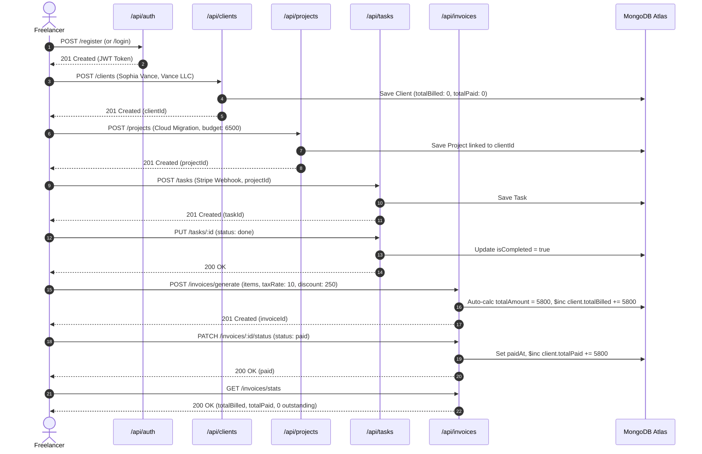

# Invoice API & Full Backend Test Documentation

**Project:** Freelance CRM & Project Tracker  
**Roadmap Stage:** Din 11 (Invoice Model, Generation API, Financial Analytics & Full Backend E2E Test)  
**Technology:** Node.js (v24+), Express.js (v5), MongoDB / Mongoose ODM (v9), JSON Web Tokens (JWT), Postman  

> 🔗 **Related Architecture Guides:**
> - [Database Planning & Schema Architecture (Din 1)](DATABASE_SCHEMA.md)
> - [Schema Relationships & Relational Integrity Blueprint (Din 2)](SCHEMA_RELATIONSHIPS.md)
> - [Backend Setup & Server Initialization (Din 3)](BACKEND_SETUP.md)
> - [Folder Structure & MongoDB Connection (Din 4)](FOLDER_STRUCTURE_AND_DB.md)
> - [User Model & Signup API (Din 5)](USER_MODEL_AND_SIGNUP_API.md)
> - [Login API & JWT Verification (Din 6)](LOGIN_API_AND_JWT.md)
> - [Role-Based Access Control - RBAC (Din 7)](ROLE_BASED_ACCESS_CONTROL.md)
> - [Client CRUD API & CRM Pipeline (Din 8)](CLIENT_CRUD_API.md)
> - [Project CRUD API & Client Linking (Din 9)](PROJECT_CRUD_API.md)
> - [Task CRUD API & Project Linking (Din 10)](TASK_CRUD_API.md)

---

## 1. Overview & Objectives (Maqsad)

Din 11 ka bunyadi maqsad platform ke financial billing aur revenue tracking engine ko mukammal karna hai:
1. **Invoice Model & Auto-Generation (`POST /api/invoices/generate` & `POST /api/invoices`)**:
   - Freelancer ko apne client ya kisi specific project ke against comprehensive invoice generate karne ki suvidha.
   - **Line Items Computation**: Har line item ka `amount = quantity * unitPrice` automatically calculate hota hai.
   - **Financial Calculations**:
     $$\text{subtotal} = \sum (\text{item.quantity} \times \text{item.unitPrice})$$
     $$\text{taxAmount} = \frac{\text{subtotal} \times \text{taxRate}}{100}$$
     $$\text{totalAmount} = \max(0, \text{subtotal} + \text{taxAmount} - \text{discount})$$
   - **Unique Auto Invoice Numbering**: Agar invoice number provide na kiya jaye tou system automatically unique formatted identifier generate karta hai: `INV-YYYY-XXXXXX`.
   - **Automatic Due Date**: Agar due date omit ki jaye tou issue date ke 14 din baad ki due date automatically assign ho jati hai.
2. **Client Balance Reconciliation**:
   - Jab koi invoice generate hoti hai, tou client document ka `totalBilled` balance atomically MongoDB `$inc` se update hota hai.
   - Jab invoice status `'paid'` me convert hoti hai (`PATCH /api/invoices/:id/status`), tou client ka `totalPaid` balance increment ho jata hai aur `paidAt` timestamp register hota hai.
   - Agar invoice update ya delete ki jaye, tou client ke `totalBilled` aur `totalPaid` balances automatically synchronize ho jate hain.
3. **Multi-Tenancy & Referential Security**:
   - Freelancer A kisi doosre freelancer (Freelancer B) ke client ya project par invoice create nahi kar sakta (`403 Forbidden`).
   - Regular users sirf apni banayi hui invoices inspect, update aur delete kar sakte hain.
4. **Financial Analytics & Dashboard Summary (`GET /api/invoices/stats`)**:
   - `totalBilled` (Gross invoiced amount)
   - `totalPaid` (Collected revenue)
   - `totalOutstanding` (Pending receivable balance)
   - `totalOverdueAmount` (Amount past due date)
   - Status counts: `draft`, `sent`, `paid`, `partially_paid`, `overdue`, `cancelled`.
5. **Relationship Endpoints**:
   - `GET /api/clients/:id/invoices`: Client ke تمام linked invoices.
   - `GET /api/projects/:id/invoices`: Project ke تمام associated milestone invoices.
6. **Full Backend Integration Test (E2E)**:
   - Mukammal lifecycle verification: **User Signup ➔ Client Create ➔ Project Create ➔ Task Create & Complete ➔ Invoice Generate ➔ Mark Paid ➔ Financial Stats Verification**.

---

## 2. API Endpoints Specification Matrix

| Method | Endpoint | Access | Allowed Roles | Description |
| :--- | :--- | :---: | :--- | :--- |
| `POST` | `/api/invoices/generate` | Private | `admin`, `agency_owner`, `freelancer` | Nayi invoice generate karein (Auto line items, tax, totals, unique number) |
| `POST` | `/api/invoices` | Private | `admin`, `agency_owner`, `freelancer` | Standard invoice create endpoint |
| `GET` | `/api/invoices` | Private | `admin`, `agency_owner`, `freelancer` | Invoices list karein (Filters: status, clientId, projectId, search, pagination) |
| `GET` | `/api/invoices/stats` | Private | `admin`, `agency_owner`, `freelancer` | Financial revenue & billing pipeline stats |
| `GET` | `/api/invoices/:id` | Private | `admin`, `agency_owner`, `freelancer` | Single invoice details with populated Client & Project |
| `PUT` | `/api/invoices/:id` | Private | `admin`, `agency_owner`, `freelancer` | Invoice details & line items update karein (Balances auto-adjust) |
| `PATCH` | `/api/invoices/:id` | Private | `admin`, `agency_owner`, `freelancer` | Partial invoice update |
| `PATCH` | `/api/invoices/:id/status` | Private | `admin`, `agency_owner`, `freelancer` | Quick status transition (e.g. `'paid'`, `'sent'`) |
| `DELETE` | `/api/invoices/:id` | Private | `admin`, `agency_owner`, `freelancer` | Invoice delete karein (Client totals safely reconciled) |
| `GET` | `/api/clients/:id/invoices` | Private | `admin`, `agency_owner`, `freelancer` | Client ke تمام linked invoices fetch karein |
| `GET` | `/api/projects/:id/invoices` | Private | `admin`, `agency_owner`, `freelancer` | Project ke تمام associated invoices fetch karein |

---

## 3. Request & Response Examples

### 3.1. Generate Invoice (`POST /api/invoices/generate`)

**Headers:**
```http
Authorization: Bearer <JWT_TOKEN>
Content-Type: application/json
```

**Request Body:**
```json
{
  "clientId": "673f8a1b2c3d4e5f6a7b8c9d",
  "projectId": "673f8a1b2c3d4e5f6a7b8c9e",
  "items": [
    {
      "description": "Sprint 1: Architecture & Cloud Setup",
      "quantity": 1,
      "unitPrice": 2500
    },
    {
      "description": "Sprint 2: Dashboard Frontend & API Integration",
      "quantity": 1,
      "unitPrice": 3000
    }
  ],
  "taxRate": 10,
  "discount": 250,
  "currency": "USD",
  "notes": "Due upon invoice receipt. Thank you for your business!"
}
```

**Response (`201 Created`):**
```json
{
  "success": true,
  "message": "Invoice generated successfully",
  "data": {
    "_id": "6740a1b2c3d4e5f6a7b8c9f0",
    "invoiceNumber": "INV-2026-000184",
    "userId": {
      "_id": "673f8a1b2c3d4e5f6a7b8c9c",
      "name": "Ahsan Adeem",
      "email": "freelancer_day11@example.com",
      "role": "freelancer"
    },
    "clientId": {
      "_id": "673f8a1b2c3d4e5f6a7b8c9d",
      "name": "Sophia Vance",
      "email": "sophia@vance.com",
      "company": "Vance Enterprises LLC",
      "currency": "USD"
    },
    "projectId": {
      "_id": "673f8a1b2c3d4e5f6a7b8c9e",
      "title": "Cloud Migration & AI Dashboard",
      "status": "in_progress"
    },
    "items": [
      {
        "description": "Sprint 1: Architecture & Cloud Setup",
        "quantity": 1,
        "unitPrice": 2500,
        "amount": 2500
      },
      {
        "description": "Sprint 2: Dashboard Frontend & API Integration",
        "quantity": 1,
        "unitPrice": 3000,
        "amount": 3000
      }
    ],
    "subtotal": 5500,
    "taxRate": 10,
    "taxAmount": 550,
    "discount": 250,
    "totalAmount": 5800,
    "currency": "USD",
    "status": "draft",
    "issueDate": "2026-09-23T18:45:00.000Z",
    "dueDate": "2026-10-07T18:45:00.000Z",
    "notes": "Due upon invoice receipt. Thank you for your business!",
    "terms": "",
    "createdAt": "2026-09-23T18:45:00.000Z",
    "updatedAt": "2026-09-23T18:45:00.000Z"
  }
}
```

---

### 3.2. Mark Invoice as Paid (`PATCH /api/invoices/:id/status`)

**Request Body:**
```json
{
  "status": "paid",
  "paymentMethod": "stripe"
}
```

**Response (`200 OK`):**
```json
{
  "success": true,
  "message": "Invoice status updated to 'paid'",
  "data": {
    "_id": "6740a1b2c3d4e5f6a7b8c9f0",
    "status": "paid",
    "paidAt": "2026-09-23T18:47:00.000Z",
    "paymentMethod": "stripe",
    "totalAmount": 5800
  }
}
```

---

### 3.3. Financial Stats (`GET /api/invoices/stats`)

**Response (`200 OK`):**
```json
{
  "success": true,
  "data": {
    "totalInvoices": 12,
    "statusCounts": {
      "draft": 2,
      "sent": 3,
      "paid": 6,
      "partiallyPaid": 0,
      "overdue": 1,
      "cancelled": 0
    },
    "financials": {
      "totalBilled": 28400.00,
      "totalPaid": 19200.00,
      "totalOutstanding": 9200.00,
      "totalOverdueAmount": 1500.00
    }
  }
}
```

---

## 4. Full End-to-End Workflow Architecture



---

## 5. Verification & Test Execution Results

Automated regression suite was executed directly against MongoDB Atlas:

```bash
npm --prefix server run test:day11
```

### Day 11 Test Suite Breakdown (75 Total Assertions):
- **Category 1: Invoice Schema Validations (16/16)**:
  - Missing `userId`, `clientId`, empty line items array
  - Enum validation on `status`, negative numbers validation on `taxRate` and `discount`
  - Subdocument validation on `quantity >= 1`, non-negative `unitPrice`, mandatory `description`
  - Pre-validation hook auto-calculation of line item totals, `subtotal`, `taxAmount`, and `totalAmount`
  - Unique invoice number generation (`INV-YYYY-XXXXXX`) and default `dueDate` (+14 days)
  - Static helper method `Invoice.generateInvoiceNumber()`
- **Category 2: Controller Validations (12/12)**:
  - 400 Bad Request on missing `clientId`, invalid `projectId`, empty items array, invalid enums, negative amounts
- **Category 3: ID Format & Relationship Validations (7/7)**:
  - 400 Bad Request on invalid MongoDB ObjectIds across GET, PUT, PATCH, DELETE, and relationship endpoints
- **Category 4: RBAC & Route Security (5/5)**:
  - 401 Unauthorized on unauthenticated requests
  - 403 Forbidden for `client` role
  - 200/201 Success for `freelancer`, `agency_owner`, and `admin` roles
- **Category 5: Live Database Multi-Tenant CRUD (21/21)**:
  - Cross-tenant client billing rejection (`403 Forbidden`)
  - Cross-tenant project linking rejection (`403 Forbidden`)
  - Automatic `$inc` synchronization of `client.totalBilled` and `client.totalPaid`
  - Multi-tenancy isolation strictly hiding invoices between different freelancers
  - Filtering by status, client, search queries across notes and invoice numbers
  - Direct relationship routes: `GET /api/clients/:id/invoices` & `GET /api/projects/:id/invoices`
  - Safe deletion with financial balance reconciliation
- **Category 6: Full End-to-End Backend Integration Test (14/14)**:
  - Complete multi-stage workflow from signup to paid invoice and pipeline summary

### Full Backend Regression (Days 5 to 11):
```bash
npm --prefix server run test:all
```
- **Day 5 (User Model & Signup API)**: 100% PASSED
- **Day 6 (Login API & JWT Verification)**: 100% PASSED
- **Day 7 (Role-Based Access Control - RBAC)**: 100% PASSED
- **Day 8 (Client CRUD API & CRM Pipeline)**: 100% PASSED
- **Day 9 (Project CRUD API & Client Linking)**: 100% PASSED
- **Day 10 (Task CRUD API & Kanban Reordering)**: 100% PASSED
- **Day 11 (Invoice API & Full Backend Test)**: 100% PASSED (75/75)
