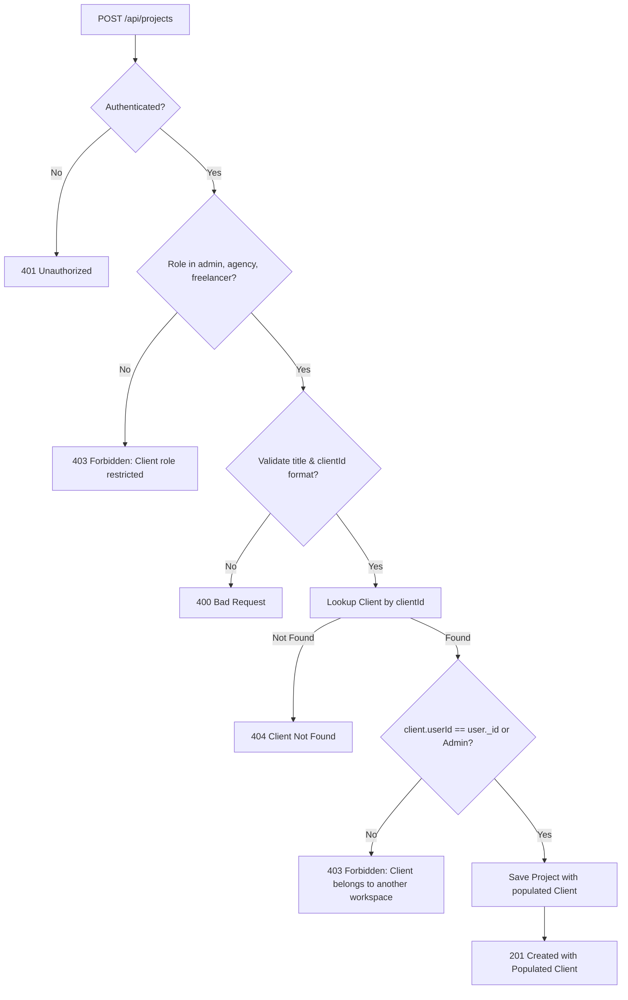

# Project CRUD API & Client Relationship Documentation

**Project:** Freelance CRM & Project Tracker  
**Roadmap Stage:** Din 9 (Project CRUD API & Client Linking)  
**Technology:** Node.js (v24+), Express.js (v5), Mongoose ODM, JSON Web Tokens (JWT), Postman  

> 🔗 **Related Architecture Guides:**
> - [Database Planning & Schema Specs (Din 1)](DATABASE_SCHEMA.md)
> - [Schema Relationships & Integrity Blueprint (Din 2)](SCHEMA_RELATIONSHIPS.md)
> - [Backend Setup & Server Initialization (Din 3)](BACKEND_SETUP.md)
> - [Folder Structure & MongoDB Connection (Din 4)](FOLDER_STRUCTURE_AND_DB.md)
> - [User Model & Signup API (Din 5)](USER_MODEL_AND_SIGNUP_API.md)
> - [Login API & JWT Verification (Din 6)](LOGIN_API_AND_JWT.md)
> - [Role-Based Access Control - RBAC (Din 7)](ROLE_BASED_ACCESS_CONTROL.md)
> - [Client CRUD API & CRM Pipeline (Din 8)](CLIENT_CRUD_API.md)

---

## 1. Overview & Objectives (Maqsad)

Din 9 ka bunyadi maqsad platform ke core delivery module ke liye **Enterprise-Grade Project Management CRUD API** banana hai aur **Client aur Project ke darmiyan relational link** qaim karna hai:

1. **Project Creation & Client Relationship Linking (`POST /api/projects`)**:
   - Har project ko kisi na kisi valid client ke sath link karna lazmi hai (`clientId` is required).
   - Multi-tenant referential integrity: Agar Freelancer A kisi aise client ki ID pass kare jo kisi doosre freelancer (Freelancer B) ka ho, ya DB mein exist na karta ho, tou system foran `403 Forbidden` ya `404 Not Found` return karta hai.
   - `completedAt` timestamp ka automatic computation agar project ka initial status `'completed'` choose kiya jaye.
   - Fixed vs Hourly pricing model, budget, hourly rate, start/due dates, tags, aur attachments support.

2. **Project Listing with Multi-Tenancy & Population (`GET /api/projects`)**:
   - Strict multi-tenancy: Har freelancer sirf apne banaye hue projects dekh sakta hai. Admins sabhi ya specific user ke projects inspect kar sakte hain.
   - Automatic Mongoose Population: Har project object ke andar linked `clientId` expand hokar client ka `name`, `company`, `email`, `phone`, aur `status` deliver karta hai.
   - Relationship filtering: `?clientId=<id>` se specific client ke tamam projects filter ho sakte hain.
   - Advanced filters: `?status=...`, `?priority=...`, `?pricingType=...`, `?tag=...`.
   - Full-text search: `?search=keyword` jo project ke `title` aur `description` ko case-insensitively scan karta hai.
   - Pagination (`?page=1&limit=10`) aur flexible sorting (`?sort=-budget`, `?sort=-createdAt`).

3. **Direct Client-to-Projects Relationship (`GET /api/clients/:id/projects`)**:
   - Client profile page ke liye dedicated relationship endpoint jo client ki details ke sath uske tamam linked projects paginate karke deta hai.

4. **Single Project Details (`GET /api/projects/:id`)**:
   - Populated Client (`name`, `email`, `company`, `address`, `currency`) aur Owner (`name`, `email`) details provide karta hai.
   - Unauthorized cross-tenant access par strict `403 Forbidden` guard.

5. **Project Update (`PUT /api/projects/:id` & `PATCH /api/projects/:id`)**:
   - Milestone tracking, budget adjustment, status transitions.
   - Status transition lifecycle: Agar status `'completed'` kiya jaye tou system automatically `completedAt = Date.now()` timestamp inject kar deta hai.

6. **Project Deletion (`DELETE /api/projects/:id`)**:
   - Project owner ya admin ke zariye project record safe remove karta hai. Cross-tenant deletion blocked with `403`.

7. **Project Pipeline & Financial Analytics (`GET /api/projects/stats`)**:
   - Dashboard widgets ke liye live project counts by status (`planning`, `in_progress`, `in_review`, `completed`, `cancelled`, `on_hold`).
   - Priority counts (`low`, `medium`, `high`, `urgent`).
   - Financial aggregations (`totalBudget`, `avgBudget`).

8. **Automated Verification & Postman Suite**:
   - 51-point automated verification suite (`server/tests/verify_day9.js`).
   - Postman Collection with automated test scripts: [`postman/Freelancer_CRM_Day9_Projects.postman_collection.json`](../postman/Freelancer_CRM_Day9_Projects.postman_collection.json).

---

## 2. API Endpoints Specification Matrix

| Method | Endpoint | Access | Allowed Roles | Description |
| :--- | :--- | :---: | :--- | :--- |
| `POST` | `/api/projects` | Private | `admin`, `agency_owner`, `freelancer` | Naya project create karein (Client link lazmi hai) |
| `GET` | `/api/projects` | Private | `admin`, `agency_owner`, `freelancer` | Projects list karein (Search, Client filter, Status, Pagination) |
| `GET` | `/api/projects/stats` | Private | `admin`, `agency_owner`, `freelancer` | Project pipeline counts aur financial summary |
| `GET` | `/api/projects/:id` | Private | `admin`, `agency_owner`, `freelancer` | Single project details with populated Client & Owner |
| `PUT` | `/api/projects/:id` | Private | `admin`, `agency_owner`, `freelancer` | Project details, status, aur budget update karein |
| `PATCH` | `/api/projects/:id` | Private | `admin`, `agency_owner`, `freelancer` | Project ka partial update (e.g. status complete karna) |
| `DELETE` | `/api/projects/:id` | Private | `admin`, `agency_owner`, `freelancer` | Project record delete karein |
| `GET` | `/api/clients/:id/projects` | Private | `admin`, `agency_owner`, `freelancer` | Specific client ke tamam linked projects fetch karein |

> **Security Guard:** `client` role users ko project management endpoints se restrict kiya gaya hai (`403 Forbidden`).

---

## 3. Detailed Request & Response Examples

### 3.1. Create Project (`POST /api/projects`)

**Headers:**
```http
Authorization: Bearer <JWT_TOKEN>
Content-Type: application/json
```

**Request Body:**
```json
{
  "title": "E-Commerce Web Platform Re-architecture",
  "description": "Migrating existing monolithic storefront to modern Next.js + Node microservices architecture with Stripe checkout.",
  "clientId": "66f07a9b1c2d3e4f5a6b7c8d",
  "status": "planning",
  "priority": "high",
  "pricingType": "fixed",
  "budget": 6500,
  "startDate": "2026-10-01T00:00:00.000Z",
  "dueDate": "2026-12-15T00:00:00.000Z",
  "tags": ["FullStack", "NextJS", "Stripe", "HighPriority"],
  "attachments": [
    {
      "name": "Architecture-Blueprint-v1.pdf",
      "url": "https://s3.amazonaws.com/nexus-crm/docs/blueprint-v1.pdf"
    }
  ]
}
```

**Response (`201 Created`):**
```json
{
  "success": true,
  "message": "Project created successfully",
  "data": {
    "_id": "673f8a1b2c3d4e5f6a7b8c9e",
    "userId": "66f07a9b1c2d3e4f5a6b7c8a",
    "clientId": {
      "_id": "66f07a9b1c2d3e4f5a6b7c8d",
      "name": "Sarah Jenkins",
      "company": "Nexus Media Labs",
      "email": "sarah.nexus@example.com",
      "phone": "+1 555-492-9900",
      "status": "active"
    },
    "title": "E-Commerce Web Platform Re-architecture",
    "description": "Migrating existing monolithic storefront to modern Next.js + Node microservices architecture with Stripe checkout.",
    "status": "planning",
    "priority": "high",
    "pricingType": "fixed",
    "budget": 6500,
    "hourlyRate": 0,
    "startDate": "2026-10-01T00:00:00.000Z",
    "dueDate": "2026-12-15T00:00:00.000Z",
    "tags": ["FullStack", "NextJS", "Stripe", "HighPriority"],
    "attachments": [
      {
        "name": "Architecture-Blueprint-v1.pdf",
        "url": "https://s3.amazonaws.com/nexus-crm/docs/blueprint-v1.pdf",
        "uploadedAt": "2026-09-22T18:15:00.000Z"
      }
    ],
    "createdAt": "2026-09-22T18:15:00.000Z",
    "updatedAt": "2026-09-22T18:15:00.000Z"
  }
}
```

---

### 3.2. List Projects (`GET /api/projects`)

**Sample Query:**
```http
GET /api/projects?search=Commerce&status=planning&page=1&limit=10&sort=-createdAt
Authorization: Bearer <JWT_TOKEN>
```

**Response (`200 OK`):**
```json
{
  "success": true,
  "count": 1,
  "total": 1,
  "page": 1,
  "pages": 1,
  "data": [
    {
      "_id": "673f8a1b2c3d4e5f6a7b8c9e",
      "userId": "66f07a9b1c2d3e4f5a6b7c8a",
      "clientId": {
        "_id": "66f07a9b1c2d3e4f5a6b7c8d",
        "name": "Sarah Jenkins",
        "company": "Nexus Media Labs",
        "email": "sarah.nexus@example.com",
        "phone": "+1 555-492-9900",
        "status": "active"
      },
      "title": "E-Commerce Web Platform Re-architecture",
      "status": "planning",
      "priority": "high",
      "budget": 6500,
      "pricingType": "fixed",
      "createdAt": "2026-09-22T18:15:00.000Z"
    }
  ]
}
```

---

### 3.3. Get Client Projects (`GET /api/clients/:id/projects`)

**Sample Query:**
```http
GET /api/clients/66f07a9b1c2d3e4f5a6b7c8d/projects
Authorization: Bearer <JWT_TOKEN>
```

**Response (`200 OK`):**
```json
{
  "success": true,
  "client": {
    "_id": "66f07a9b1c2d3e4f5a6b7c8d",
    "name": "Sarah Jenkins",
    "company": "Nexus Media Labs",
    "email": "sarah.nexus@example.com"
  },
  "count": 2,
  "total": 2,
  "page": 1,
  "pages": 1,
  "data": [
    {
      "_id": "673f8a1b2c3d4e5f6a7b8c9e",
      "title": "E-Commerce Web Platform Re-architecture",
      "status": "in_progress",
      "budget": 6500
    },
    {
      "_id": "673f8a1b2c3d4e5f6a7b8c9f",
      "title": "Cloud Infrastructure Migration",
      "status": "completed",
      "budget": 3000
    }
  ]
}
```

---

### 3.4. Project Pipeline Analytics (`GET /api/projects/stats`)

**Sample Query:**
```http
GET /api/projects/stats
Authorization: Bearer <JWT_TOKEN>
```

**Response (`200 OK`):**
```json
{
  "success": true,
  "data": {
    "total": 6,
    "statusBreakdown": {
      "planning": 2,
      "in_progress": 2,
      "in_review": 1,
      "completed": 1,
      "cancelled": 0,
      "on_hold": 0
    },
    "priorityBreakdown": {
      "low": 1,
      "medium": 2,
      "high": 2,
      "urgent": 1
    },
    "financials": {
      "totalBudget": 28400,
      "avgBudget": 4733
    }
  }
}
```

---

## 4. Referential Integrity & Multi-Tenancy Rules



1. **Client Existence Check**:
   Agar project banate waqt aisa `clientId` diya jaye jo database mein maujood na ho, tou system error deta hai:
   ```json
   {
     "success": false,
     "message": "Client not found with id: 66f07a9b1c2d3e4f5a6b7c8d"
   }
   ```

2. **Cross-Tenant Client Isolation**:
   Agar Freelancer A kisi aise client ko link karne ki koshish kare jo Freelancer B ka ho:
   ```json
   {
     "success": false,
     "message": "Not authorized: Client does not belong to your workspace."
   }
   ```

3. **Status Transition & `completedAt`**:
   Jab project ka status `'completed'` mark kiya jata hai, backend automatically `completedAt = new Date()` set kar deta hai agar request mein explicitly provide na kiya gaya ho.

---

## 5. Running Automated Tests

Project ke root directory se test execute karein:

```bash
# Run Day 9 Project CRUD Test Suite (51 tests)
npm run test:day9

# Run Complete End-to-End Test Suite (161 tests across Days 5, 6, 7, 8, and 9)
npm run test:all
```

---

## 6. Postman Collection Import

1. Postman open karein aur **Import** button par click karein.
2. File select karein: `postman/Freelancer_CRM_Day9_Projects.postman_collection.json`.
3. Collection variables check karein:
   - `baseUrl`: `http://localhost:5000` (default)
   - `token`: Login request run karne par automatically populate ho jayega.
   - `clientId`: Client create karne par auto-save hoga.
   - `projectId`: Project create karne par auto-save hoga.
