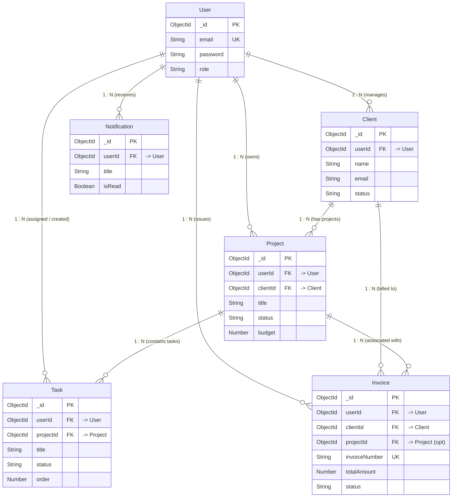

# Schema Relationships & Relational Integrity Blueprint

**Project:** Freelance CRM & Project Tracker  
**Roadmap Stage:** Din 2 (Schema Relationships & Architecture Diagrams)  
**Database:** MongoDB with Mongoose ODM  
**Visual Artifacts:** [Excalidraw Diagram](schema-diagram.excalidraw) • [SVG Vector Diagram](schema-diagram.svg)

---

## 1. Executive Summary

Din 1 me humne core collections (`User`, `Client`, `Project`, `Task`, `Invoice`, `Notification`) ki field-level specifications define ki thin. 

**Din 2 ka maqsad:**
1. Collections ke darmiyan relationships ko comprehensively map karna (`Project -> Tasks`, `Client -> Projects`, etc.).
2. Relational integrity, referential constraints, aur cascading policies define karna taake database consistent rahe.
3. MongoDB data modeling principles (Embedding vs Referencing) ko document karna.
4. Mongoose `.populate()` aur Virtual Population patterns establish karna.
5. Pura schema visual diagram (Excalidraw aur SVG format me) create karna.

---

## 2. Visual Architecture Diagrams

### 2.1 Visual Schema Diagram (SVG Preview)

Neeche diya gaya diagram tamam collections ke Primary Keys (`_id`), Foreign Keys (`ObjectId` references), aur unke darmian 1:N cardinality connectors ko depict karta hai:


---

### 2.2 Excalidraw Interactive Diagram (`schema-diagram.excalidraw`)

Aap is project ke diagram ko Excalidraw me direct edit aur interact kar sakte hain:
- **File Location:** [`docs/schema-diagram.excalidraw`](schema-diagram.excalidraw)
- **Kaise Open Karein:**
  1. Browser me [excalidraw.com](https://excalidraw.com) open karein.
  2. Top-left menu (hamburger icon) par click karke **"Open"** choose karein (ya file drag-and-drop karein).
  3. `docs/schema-diagram.excalidraw` select karein. Tamam custom color-coded cards, hand-drawn styles, aur relationship connectors editable format me load ho jayenge.

---

### 2.3 Mermaid Entity Relationship Diagram (ERD)



---

## 3. Relationship Matrix & Cardinality

| Source Collection | Target Collection | Relationship Type | Cardinality | Foreign Key (`ref`) | Index Strategy | Cascade / Delete Policy |
| :--- | :--- | :--- | :--- | :--- | :--- | :--- |
| **`User`** | `Client` | 1-to-Many | `1 : N` | `Client.userId` | `{ userId: 1, email: 1 }` | Restricted (User delete soft-archives all data) |
| **`User`** | `Project` | 1-to-Many | `1 : N` | `Project.userId` | `{ userId: 1, status: 1 }` | Soft-delete / Archive |
| **`User`** | `Task` | 1-to-Many | `1 : N` | `Task.userId` | `{ userId: 1, dueDate: 1 }` | Reassign or Soft-delete |
| **`User`** | `Invoice` | 1-to-Many | `1 : N` | `Invoice.userId` | `{ userId: 1, status: 1 }` | Prevent Hard Delete (Audit Compliance) |
| **`User`** | `Notification` | 1-to-Many | `1 : N` | `Notification.userId` | `{ userId: 1, isRead: 1 }` | Auto-Cascade Delete |
| **`Client`** | `Project` | 1-to-Many | `1 : N` | `Project.clientId` | `{ clientId: 1 }` | Restrict deletion if active projects exist |
| **`Client`** | `Invoice` | 1-to-Many | `1 : N` | `Invoice.clientId` | `{ clientId: 1 }` | Restrict deletion if invoices exist |
| **`Project`** | `Task` | 1-to-Many | `1 : N` | `Task.projectId` | `{ projectId: 1, status: 1, order: 1 }` | Cascade Delete / Archive Tasks with Project |
| **`Project`** | `Invoice` | 1-to-Many (Optional) | `1 : N` | `Invoice.projectId` | `{ projectId: 1 }` | Set Null on Project Delete (Invoices preserved) |

---

## 4. Deep-Dive: Core Relationship Breakdowns

### 4.1 `Client -> Projects` (1 : N)

Har client ke paas multiple projects ho sakte hain, jabke har project strictly ek primary client se belongs karta hai.

- **Referencing Mechanism:** `Project` collection me `clientId` store kiya jata hai (`ref: 'Client'`).
- **Kyun Referencing use ki?** 
  - Projects ke pass bari metadata hoti hai (tasks, attachments, milestones, budgets, invoices). Agar hum Client document ke andar projects array embed karte to MongoDB ki 16MB document size limit hit hone ka khatra hota aur client queries bohot heavy ho jateen.
- **Referential Integrity Rule:**
  - **Constraint:** Agar kisi client ke ongoing projects hain (`status: 'in_progress'`), toh system client ko delete karne se block karega:
  ```javascript
  // Business logic check before deleting client
  const activeProjects = await Project.countDocuments({ clientId, status: { $ne: 'completed' } });
  if (activeProjects > 0) {
    throw new Error("Cannot delete client with active ongoing projects. Archive client instead.");
  }
  ```

---

### 4.2 `Project -> Tasks` (1 : N)

Har project ke andar multiple tasks/tickets hote hain jo Kanban board columns (`todo`, `in_progress`, `in_review`, `done`) me move karte hain.

- **Referencing Mechanism:** `Task` collection me `projectId` store kiya jata hai (`ref: 'Project'`).
- **Kyun Referencing use ki?**
  1. **Kanban Performance:** Kanban board me jab drag-and-drop se task ka status ya `order` update hota hai, toh pooray project document ko lock/save nahi karna parta. Sirf single lightweight Task document update hota hai (`O(1)` atomic write).
  2. **Filtering & Pagination:** Developer ko project ke tasks ko filter karna hota hai (e.g. `status === 'in_progress'` ya `priority === 'urgent'`), jo referenced collection me simple index scan `{ projectId: 1, status: 1, order: 1 }` se milliseconds me return hota hai.
- **Cascading Policy:**
  - Jab koi Project delete kiya jaye (ya soft-delete kiya jaye), toh uske associated tamam tasks ko automatically delete ya archive kar diya jata hai:
  ```javascript
  // Mongoose middleware on Project deletion
  projectSchema.pre('deleteOne', { document: true, query: false }, async function(next) {
    await mongoose.model('Task').deleteMany({ projectId: this._id });
    next();
  });
  ```

---

### 4.3 `User -> Clients / Projects / Invoices` (Multi-Tenancy Isolation)

- Platform multi-tenant architecture follow karta hai: Har freelancer ya agency owner sirf apna data access kar sakta hai.
- Har root document (`Client`, `Project`, `Task`, `Invoice`) me `userId` reference maujood hai.
- **Security Rule:** Tamam database queries me strictly session user ka `userId` inject kiya jata hai:
  ```javascript
  // Example: Client listing API query
  const clients = await Client.find({ userId: req.user._id });
  ```

---

### 4.4 `Client -> Invoices` & `Project -> Invoices` (Financial Integrity)

- **`Client -> Invoice`:** Invoices hamesha client se associate hoti hain taake client statement aur total billing calculate ho sake.
- **`Project -> Invoice` (Optional):** Agar invoice kisi specific project ke milestone ya hourly work ki hai, toh `projectId` provide kiya jata hai. Agar general retainer ya consulting fee hai, toh `projectId` null ho sakta hai.
- **Immutability & Integrity:** Agar project delete bhi ho jaye, Invoice record **kabhi delete nahi hota** (Legal & tax compliance). Invoice me `projectId` sirf `null` set ho sakta hai, lekin client reference aur total amounts intact rehte hain.

---

## 5. MongoDB Data Modeling: Embedding vs Referencing Decisions

MongoDB me document modeling ka sab se critical decision "Embed vs Reference" hota hai:

| Data Entity | Modeling Decision | Justification |
| :--- | :--- | :--- |
| **`Invoice.items`** | **Embedded** (Sub-document Array) | Line items hamesha invoice ke sath hi load hote hain, independent query nahi banti, aur items bounded hote hain (1 se 50 items max). Is se atomic billing calculations milti hain. |
| **`Client.address`** | **Embedded** (Single Object) | Address client ka 1:1 part hai, alag collection ki zaroorat nahi. |
| **`Project.attachments`** | **Embedded** (Array of Objects) | File metadata (name, url, timestamp) project ke sath tightly bound hai. |
| **`Project -> Tasks`** | **Referenced** (Normalized) | Tasks dynamically grow kar sakte hain (unbounded), Kanban board drag-and-drop me individual document updates chahiye, aur complex filtering karni hoti hai. |
| **`Client -> Projects`** | **Referenced** (Normalized) | Client lightweight rehna chahiye; Projects khud bohat baray documents hain jin ke apne children (tasks) hain. |
| **`User -> Invoices`** | **Referenced** (Normalized) | Financial records ko tamper-proof aur standalone collection me hona chahiye jahan audit logs aur Stripe webhooks easily match ho sakein. |

---

## 6. Mongoose Virtual Population & Query Optimization

### 6.1 Reverse Relationship via Virtuals

Mongoose Virtuals se hum Parent schema me child array store kiye baghair Parent document pe child records populate kar sakte hain:

#### Client Model me Projects Virtual:
```javascript
// models/Client.js
const clientSchema = new mongoose.Schema({
  userId: { type: mongoose.Schema.Types.ObjectId, ref: 'User', required: true },
  name: { type: String, required: true },
  // ... other fields
}, { timestamps: true, toJSON: { virtuals: true }, toObject: { virtuals: true } });

// Virtual relationship: Client has many Projects
clientSchema.virtual('projects', {
  ref: 'Project',
  localField: '_id',
  foreignField: 'clientId'
});
```

#### Project Model me Tasks Virtual:
```javascript
// models/Project.js
const projectSchema = new mongoose.Schema({
  userId: { type: mongoose.Schema.Types.ObjectId, ref: 'User', required: true },
  clientId: { type: mongoose.Schema.Types.ObjectId, ref: 'Client', required: true },
  title: { type: String, required: true },
  // ... other fields
}, { timestamps: true, toJSON: { virtuals: true }, toObject: { virtuals: true } });

// Virtual relationship: Project has many Tasks
projectSchema.virtual('tasks', {
  ref: 'Task',
  localField: '_id',
  foreignField: 'projectId'
});
```

### 6.2 High-Performance Population Queries

Jab hum client ya project fetch karte hain, toh virtual populate use karke ek hi optimized query me related data mil jata hai:

```javascript
// Fetch Project with populated Client and its Kanban Tasks
const project = await Project.findOne({ _id: projectId, userId: req.user._id })
  .populate('clientId', 'name email company')
  .populate({
    path: 'tasks',
    select: 'title status priority dueDate order isCompleted',
    options: { sort: { order: 1 } }
  })
  .lean();
```

> [!TIP]
> `.lean()` call karne se Mongoose internal tracking overhead eliminate ho jata hai aur read queries 3x-5x fast ho jati hain.

---

## 7. Next Step: Din 3 Alignment

Din 2 ka relationship mapping aur visual schema documentation complete ho chuka hai.
Agla step (**Din 3**) hoga:
- Node.js & Express environment configuration (`dotenv`, `cors`, `helmet`)
- MongoDB Atlas / local connection setup via Mongoose
- Models implementation code (`User.js`, `Client.js`, `Project.js`, `Task.js`, `Invoice.js`, `Notification.js`) with the exact schemas & relationships established in Din 1 & Din 2.
